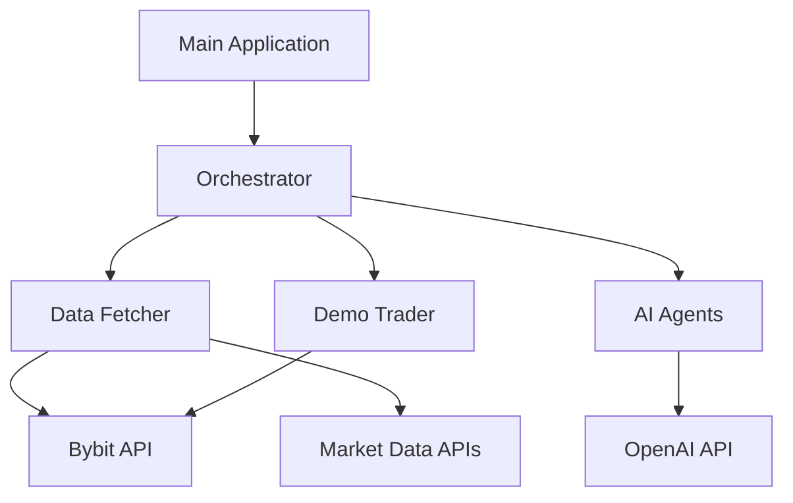

# Crypto Analysis Multi-Agent System Using OpenAI Swarm

A sophisticated cryptocurrency analysis system that leverages multiple AI agents to provide comprehensive market insights and automated demo trading capabilities.

## Overview

This system employs five specialized AI agents:
1. **Technical Analyst**: Evaluates blockchain architecture, consensus mechanisms, and security features
2. **Financial Analyst**: Analyzes market metrics, trading volumes, and price patterns
3. **Legal Advisor**: Assesses regulatory compliance and jurisdictional risks
4. **Market Strategist**: Monitors market trends and sentiment analysis
5. **Demo Trader**: Executes simulated trades on Bybit based on aggregated insights

## Technical Overview

### System Architecture



### Core Components

1. **Orchestrator (`orchestrator.py`)**
   - Central coordination of all system components
   - Manages data flow between agents
   - Handles synchronization and error handling
   - Aggregates and processes agent outputs

2. **Data Fetcher (`data_fetcher.py`)**
   - Implements rate-limited API calls
   - Handles data normalization and validation
   - Caches responses for efficiency
   - Supports multiple data sources

3. **AI Agents (`agents.py`)**
   - Implements Agent Factory pattern
   - Each agent specializes in specific analysis:
     ```python
     class BaseAgent:
         def analyze(self, data): pass
     
     class TechnicalAgent(BaseAgent):
         def analyze(self, data):
             # Technical analysis implementation
     ```

4. **Demo Trader (`trader.py`)**
   - Implements trading strategy pattern
   - Handles position management
   - Includes risk management rules
   - Simulates trade execution

### Data Flow

1. **Input Processing**
   ```
   Raw Market Data → Normalization → Validation → Caching
   ```

2. **Analysis Pipeline**
   ```
   Normalized Data → Agent Analysis → Aggregation → Strategy Formation
   ```

3. **Trading Flow**
   ```
   Strategy → Risk Check → Position Sizing → Order Execution
   ```

## Developer Overview

### Key Interfaces

1. **Agent Interface**
   ```python
   class BaseAgent:
       def analyze(self, data: Dict) -> AnalysisResult:
           """
           Base analysis method all agents must implement
           """
           pass
   ```

2. **Data Fetcher Interface**
   ```python
   class DataFetcher:
       async def fetch_market_data(self, symbol: str) -> MarketData:
           """
           Fetches and normalizes market data
           """
           pass
   ```

### Error Handling

1. **Hierarchical Error System**
   ```
   BaseError
   ├── APIError
   │   ├── RateLimitError
   │   └── AuthenticationError
   ├── ValidationError
   └── TradeError
   ```

2. **Retry Mechanism**
   - Exponential backoff for API calls
   - Circuit breaker pattern for failing services
   - Graceful degradation for non-critical components

### Configuration Management

1. **Environment Variables**
   - API credentials
   - System parameters
   - Feature flags

2. **Runtime Configuration**
   - Trading parameters
   - Risk management rules
   - Agent behavior settings

### Testing Strategy

1. **Unit Tests**
   - Agent logic
   - Data validation
   - Trading rules

2. **Integration Tests**
   - API interactions
   - Multi-agent coordination
   - End-to-end workflows

3. **Mock Services**
   - API responses
   - Market data
   - Trading execution

### Development Workflow

1. **Local Development**
   ```bash
   # Setup development environment
   make setup-dev
   
   # Run tests
   make test
   
   # Run linting
   make lint
   ```

2. **CI/CD Pipeline**
   - Automated testing
   - Code quality checks
   - Documentation generation

### Performance Considerations

1. **Optimization Techniques**
   - Data caching
   - Batch processing
   - Asynchronous operations

2. **Resource Management**
   - Connection pooling
   - Memory usage optimization
   - CPU utilization control

## Prerequisites

- Python 3.8 or higher
- A valid OpenAI API key
- A Bybit account with API access
- Git (for cloning the repository)

## Initial Setup

1. **Clone the Repository**
   ```bash
   git clone https://github.com/GroenOogSeeMonster/MyCryptoCrew
   cd MyCryptoCrew
   ```

2. **Create and Activate Virtual Environment**
   ```bash
   # On Windows
   python -m venv venv
   venv\Scripts\activate

   # On macOS/Linux
   python3 -m venv venv
   source venv/bin/activate
   ```

3. **Install Dependencies**
   ```bash
   pip install -r requirements.txt
   ```

## API Key Setup

### OpenAI API Key
1. Visit [OpenAI's platform](https://platform.openai.com/signup)
2. Create an account or sign in
3. Navigate to API settings
4. Create a new API key
5. Copy the key (store it safely - it won't be shown again)

### Bybit API Keys
1. Go to [Bybit](https://www.bybit.com/app/user/api-management)
2. Create an account if you haven't already
3. Complete any required verification
4. Navigate to API Management
5. Create a new API key pair
   - Select 'System Generated'
   - Enable 'Contract Trading' and 'Spot Trading'
   - Set IP restrictions if desired
6. Copy both the API key and secret (store them safely)

## Configuration

1. **Create Environment File**
   ```bash
   cp .env.example .env
   ```

2. **Update Environment Variables**
   Open `.env` and add your API keys:
   ```text
   OPENAI_API_KEY=your_openai_key_here
   BYBIT_API_KEY=your_bybit_key_here
   BYBIT_API_SECRET=your_bybit_secret_here
   ```

## Running the Analysis

1. **Ensure Virtual Environment is Active**
   ```bash
   # Windows
   venv\Scripts\activate

   # macOS/Linux
   source venv/bin/activate
   ```

2. **Execute the Script**
   ```bash
   python -m src.main
   ```

3. **Find Results**
   - Analysis reports are generated in the `reports` directory
   - Each report is timestamped and includes insights from all agents

## Project Structure
```
crypto_analysis_project/
├── src/
│   ├── __init__.py
│   ├── config.py
│   ├── data_fetcher.py
│   ├── agents.py
│   ├── trader.py
│   ├── orchestrator.py
│   └── main.py
├── tests/
├── data/
├── reports/
├── requirements.txt
├── .env
└── README.md
```

## Features

- Real-time cryptocurrency data fetching
- Multi-agent analysis system
- Technical and fundamental analysis
- Regulatory compliance checking
- Sentiment analysis
- Automated demo trading
- Comprehensive report generation

## Output

The system generates a detailed markdown report including:
- Individual agent analyses
- Combined insights
- Risk assessments
- Trading recommendations
- Demo trading results

## Troubleshooting

### Common Issues:

1. **API Key Errors**
   - Verify keys are correctly copied to `.env`
   - Check for whitespace in API keys
   - Ensure API keys have correct permissions

2. **Dependencies Issues**
   ```bash
   pip install --upgrade pip
   pip install -r requirements.txt --force-reinstall
   ```

3. **Rate Limiting**
   - The system implements automatic rate limiting
   - If you encounter issues, wait a few minutes before retrying

## Contributing

1. Fork the repository
2. Create a feature branch
3. Commit changes
4. Push to the branch
5. Create a Pull Request

## License

This project is licensed under the Apache License 2.0 - see below for details:
Copyright 2024 GroenOogSeeMonster
Licensed under the Apache License, Version 2.0 (the "License");
you may not use this file except in compliance with the License.
You may obtain a copy of the License at
http://www.apache.org/licenses/LICENSE-2.0
Unless required by applicable law or agreed to in writing, software
distributed under the License is distributed on an "AS IS" BASIS,
WITHOUT WARRANTIES OR CONDITIONS OF ANY KIND, either express or implied.
See the License for the specific language governing permissions and
limitations under the License.


## Support

For support, please open an issue in the GitHub repository or contact [your contact information].

## Disclaimer

This software is for educational and research purposes only. Do not use it for financial decisions without proper validation. Always perform your own due diligence before trading.